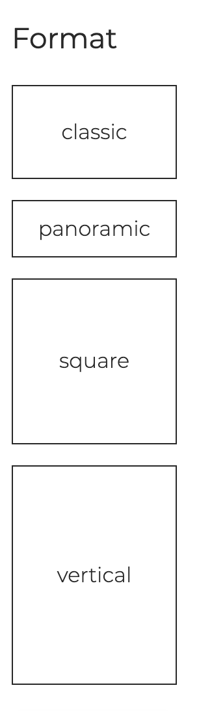
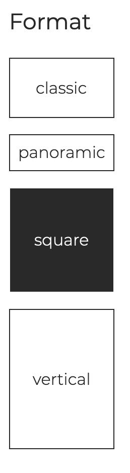

Select format

Imagine you have a shop that sells pictures and there is a menu where you can search for pictures based on their format. Use checkboxes to create a form like the one below.

1. each item should have a different size, matching as close as possible the format itself
1. 

When an element is checked

